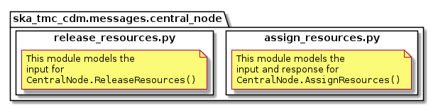
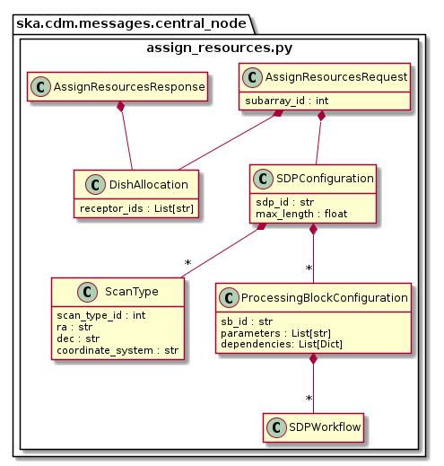
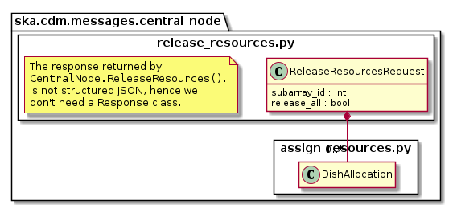

.. _`CentralNode commands`:

===============
TMC CentralNode
===============

Overview
========

Sub-array resource allocation is achieved via communication with a TMC
CentralNode device. The ``centralnode`` package models the JSON input and
responses for TMC CentralNode commands. The contents of this package are
shown in the figure below.

Classes in the `assign_resources.py`_ module model the arguments for the
``CentralNode.AssignResources()`` command.

Classes in the `release_resources.py`_ module model the arguments for the
``CentralNode.ReleaseResources()`` command.

assign_resources.py
===================

   assign_resources.py object model

The ``assign_resources.py`` module models the the JSON input and response
for a ``CentralNode.AssignResources()`` command.

Example JSON input modelled by ``AssignResourcesRequest`` for MID:

.. code-block:: JSON

  {
    "subarrayID": 1,
    "dish": {
      "receptorIDList": ["0001", "0002"]
    },
     "sdp": {
        "id": "sbi-mvp01-20200325-00001",
        "max_length": 100.0,
        "scan_types": [
          {
            "id": "science_A",
            "coordinate_system": "ICRS", "ra": "02:42:40.771", "dec": "-00:00:47.84",
            "subbands": [{
               "freq_min": 0.35e9, "freq_max": 1.05e9, "nchan": 372,
               "input_link_map": [[1,0], [101,1]]
            }]
          },
          {
            "id": "calibration_B",
            "coordinate_system": "ICRS", "ra": "12:29:06.699", "dec": "02:03:08.598",
            "subbands": [{
              "freq_min": 0.35e9, "freq_max": 1.05e9, "nchan": 372,
              "input_link_map": [[1,0], [101,1]]
            }]
          }
        ],
        "processing_blocks": [
          {
            "id": "pb-mvp01-20200325-00001",
            "workflow": {"type": "realtime", "id": "vis_receive", "version": "0.1.0"},
            "parameters": {}
          },
          {
            "id": "pb-mvp01-20200325-00002",
            "workflow": {"type": "realtime", "id": "test_realtime", "version": "0.1.0"},
            "parameters": {}
          },
          {
            "id": "pb-mvp01-20200325-00003",
            "workflow": {"type": "batch", "id": "ical", "version": "0.1.0"},
            "parameters": {},
            "dependencies": [
              {"pb_id": "pb-mvp01-20200325-00001", "type": ["visibilities"]}
            ]
          },
          {
            "id": "pb-mvp01-20200325-00004",
            "workflow": {"type": "batch", "id": "dpreb", "version": "0.1.0"},
            "parameters": {},
            "dependencies": [
              {"pb_id": "pb-mvp01-20200325-00003", "type": ["calibration"]}
            ]
          }
        ]
      }
  }

Example JSON response modelled by ``AssignResourcesResponse`` for MID:

.. code-block:: JSON

  {
    "dish": {
      "receptorIDList_success": ["0001", "0002"]
    }
  }

Example JSON input modelled by ``AssignResourcesRequest`` for LOW:

.. code-block:: JSON

  {
    "interface": "https://schema.skao.int/ska-low-tmc-assignresources/1.0",
    "subarray_id": 1,
    "mccs": {
        "subarray_beam_ids": [1],
        "station_ids": [[1,2]],
        "channel_blocks": [3]
     },
    "sdp": {
        ... # omitted as TMC will ignore SDP this PI
     }
  }

release_resources.py
====================

   release_resources.py object model

The ``release_resources.py`` module models the input JSON for a
``CentralNode.ReleaseResources()`` command.

Example ReleaseResourcesRequest JSON that requests specific dishes be released
from a sub-array:

.. code-block:: JSON

  {
    "subarrayID": 1,
    "dish": {
      "receptorIDList": ["0001", "0002"]
    }
  }

Example JSON that requests all sub-array resources be released:

.. code-block:: JSON

  {
    "subarrayID": 1,
    "releaseALL": true
  }

Example JSON that requests all sub-array resources be released for LOW:

.. code-block:: JSON

  {
    "interface": "https://schema.skatelescope.org/ska-low-tmc-releaseresources/1.0",
    "subarray_id": 1,
    "release_all": true
  }