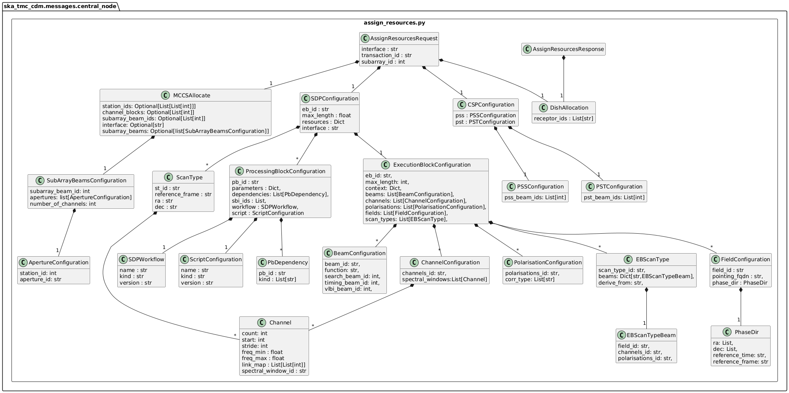
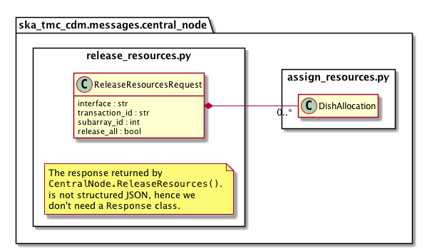

.. _`CentralNode commands`:

===============
TMC CentralNode
===============

Overview
========

Sub-array resource allocation is achieved via communication with a TMC
CentralNode device. The ``centralnode`` package models the JSON input and
responses for TMC CentralNode commands. The contents of this package are
shown in the figure below.

.. figure:: centralnode.png
   :align: center
   :alt: High-level overview of centralnode package

Classes in the `assign_resources.py`_ module model the arguments for the
``CentralNode.AssignResources()`` command.

Classes in the `release_resources.py`_ module model the arguments for the
``CentralNode.ReleaseResources()`` command.

assign_resources.py
===================

Classes in the `release_resources.py`_ module model for PI16 the arguments for the
``CentralNode.ReleaseResources()`` command.

.. figure:: assignresource_PI16.png
   :align: center
   :alt: Overview of the assign_resources.py module

   assign_resources.py object model

The ``assign_resources.py`` module models the the JSON input and response
for a ``CentralNode.AssignResources()`` command.

Example JSON input modelled by ``AssignResourcesRequest`` for MID:

.. code-block:: JSON

  {
    "interface": "https://schema.skao.int/ska-tmc-assignresources/2.0",
    "transaction_id": "txn-mvp01-20200325-00001",
    "subarray_id": 1,
    "dish": {
      "receptor_ids": ["0001", "0002"]
    },
     "sdp": {
        "interface": "https://schema.skao.int/ska-sdp-assignresources/2.0",
        "eb_id": "eb-mvp01-20200325-00001",
        "max_length": 100.0,
        "scan_types": [
          {
            "scan_type_id": "science_A",
            "reference_frame": "ICRS", "ra": "02:42:40.771", "dec": "-00:00:47.84",
            "channels": [{
               "count": 744, "start": 0, "stride": 2, "freq_min": 0.35e9, "freq_max": 1.05e9,
               "link_map": [[1,0], [101,1]]
            }]
          },
          {
            "scan_type_id": "calibration_B",
            "reference_frame": "ICRS", "ra": "12:29:06.699", "dec": "02:03:08.598",
            "channels": [{
              "count": 744, "start": 0, "stride": 2, "freq_min": 0.35e9, "freq_max": 1.05e9,
              "link_map": [[1,0], [101,1]]
            }]
          }
        ],
        "processing_blocks": [
          {
            "pb_id": "pb-mvp01-20200325-00001",
            "workflow": {"kind": "realtime", "name": "vis_receive", "version": "0.1.0"},
            "parameters": {}
          },
          {
            "pb_id": "pb-mvp01-20200325-00002",
            "workflow": {"kind": "realtime", "name": "test_realtime", "version": "0.1.0"},
            "parameters": {}
          },
          {
            "pb_id": "pb-mvp01-20200325-00003",
            "workflow": {"kind": "batch", "name": "ical", "version": "0.1.0"},
            "parameters": {},
            "dependencies": [
              {"pb_id": "pb-mvp01-20200325-00001", "kind": ["visibilities"]}
            ]
          },
          {
            "pb_id": "pb-mvp01-20200325-00004",
            "workflow": {"kind": "batch", "name": "dpreb", "version": "0.1.0"},
            "parameters": {},
            "dependencies": [
              {"pb_id": "pb-mvp01-20200325-00003", "kind": ["calibration"]}
            ]
          }
        ]
      }
  }

Example JSON input PI16 modelled by ``AssignResourcesRequest`` for MID:

.. code-block:: JSON

    {
      "interface": "https://schema.skao.int/ska-tmc-assignresources/2.1",
      "transaction_id": "txn-....-00001",
      "subarray_id": 1,
      "dish": {
        "receptor_ids": [
          "0001"
        ]
      },
      "sdp": {
        "interface": "https://schema.skao.int/ska-sdp-assignres/0.4",
        "execution_block": {
          "eb_id": "eb-mvp01-20200325-00001",
          "max_length": 100,
          "context": {
            
          },
          "beams": [
            {
              "beam_id": "vis0",
              "function": "visibilities"
            },
            {
              "beam_id": "pss1",
              "search_beam_id": 1,
              "function": "pulsar search"
            },
            {
              "beam_id": "pss2",
              "search_beam_id": 2,
              "function": "pulsar search"
            },
            {
              "beam_id": "pst1",
              "timing_beam_id": 1,
              "function": "pulsar timing"
            },
            {
              "beam_id": "pst2",
              "timing_beam_id": 2,
              "function": "pulsar timing"
            },
            {
              "beam_id": "vlbi1",
              "vlbi_beam_id": 1,
              "function": "vlbi"
            }
          ],
          "channels": [
            {
              "channels_id": "vis_channels",
              "spectral_windows": [
                {
                  "count": 744,
                  "start": 0,
                  "stride": 2,
                  "freq_min": 350000000,
                  "freq_max": 368000000,
                  "link_map": [
                    [
                      0,
                      0
                    ],
                    [
                      200,
                      1
                    ],
                    [
                      744,
                      2
                    ],
                    [
                      944,
                      3
                    ]
                  ]
                },
                {
                  "spectral_window_id": "fsp_2_channels",
                  "count": 744,
                  "start": 2000,
                  "stride": 1,
                  "freq_min": 360000000,
                  "freq_max": 368000000,
                  "link_map": [
                    [
                      2000,
                      4
                    ],
                    [
                      2200,
                      5
                    ]
                  ]
                },
                {
                  "spectral_window_id": "zoom_window_1",
                  "count": 744,
                  "start": 4000,
                  "stride": 1,
                  "freq_min": 360000000,
                  "freq_max": 361000000,
                  "link_map": [
                    [
                      4000,
                      6
                    ],
                    [
                      4200,
                      7
                    ]
                  ]
                }
              ]
            },
            {
              "channels_id": "pulsar_channels",
              "spectral_windows": [
                {
                  "spectral_window_id": "pulsar_fsp_channels",
                  "count": 744,
                  "start": 0,
                  "freq_min": 350000000,
                  "freq_max": 368000000
                }
              ]
            }
          ],
          "polarisations": [
            {
              "polarisations_id": "all",
              "corr_type": [
                "XX",
                "XY",
                "YY",
                "YX"
              ]
            }
          ],
          "fields": [
            {
              "field_id": "field_a",
              "phase_dir": {
                "ra": [
                  123,
                  0.1
                ],
                "dec": [
                  123,
                  0.1
                ],
                "reference_time": "...",
                "reference_frame": "ICRF3"
              },
              "pointing_fqdn": "low-tmc/telstate/0/pointing"
            }
          ]
        },
        "processing_blocks": [
          {
            "pb_id": "pb-mvp01-20200325-00001",
            "sbi_ids": [
              "sbi-mvp01-20200325-00001"
            ],
            "script": {
              
            },
            "parameters": {
              
            },
            "dependencies": {
              
            }
          },
          {
            "pb_id": "pb-mvp01-20200325-00002",
            "sbi_ids": [
              "sbi-mvp01-20200325-00002"
            ],
            "script": {
              
            },
            "parameters": {
              
            },
            "dependencies": {
              
            }
          },
          {
            "pb_id": "pb-mvp01-20200325-00003",
            "sbi_ids": [
              "sbi-mvp01-20200325-00001",
              "sbi-mvp01-20200325-00002"
            ],
            "script": {
              
            },
            "parameters": {
              
            },
            "dependencies": {
              
            }
          }
        ],
        "resources": {
          "csp_links": [
            1,
            2,
            3,
            4
          ],
          "receptors": [
            "FS4",
            "FS8"
          ],
          "receive_nodes": 10
        }
      }
    }

Example JSON response modelled by ``AssignResourcesResponse`` for MID:

.. code-block:: JSON

  {
    "dish": {
      "receptor_ids_allocated": ["0001", "0002"]
    }
  }

Example JSON input modelled by ``AssignResourcesRequest`` for LOW:

.. code-block:: JSON

  {
    "interface": "https://schema.skao.int/ska-low-tmc-assignresources/2.0",
    "subarray_id": 1,
    "mccs": {
        "subarray_beam_ids": [1],
        "station_ids": [[1,2]],
        "channel_blocks": [3]
     }
  }

release_resources.py
====================

   release_resources.py object model

The ``release_resources.py`` module models the input JSON for a
``CentralNode.ReleaseResources()`` command.

Example ReleaseResourcesRequest JSON that requests specific dishes be released
from a sub-array:

.. code-block:: JSON

  {
    "interface": "https://schema.skao.int/ska-tmc-releaseresources/2.0",
    "transaction_id": "txn-mvp01-20200325-00001",
    "subarray_id": 1, 
    "receptor_ids": ["0001", "0002"]
  }

Example JSON that requests all sub-array resources be released:

.. code-block:: JSON

  {
    "interface": "https://schema.skao.int/ska-tmc-releaseresources/2.0",
    "transaction_id": "txn-mvp01-20200325-00001",
    "subarray_id": 1,
    "release_all": true
  }

Example JSON that requests all sub-array resources be released for LOW:

.. code-block:: JSON

  {
    "interface": "https://schema.skao.int/ska-low-tmc-releaseresources/2.0",
    "subarray_id": 1,
    "release_all": true
  }
