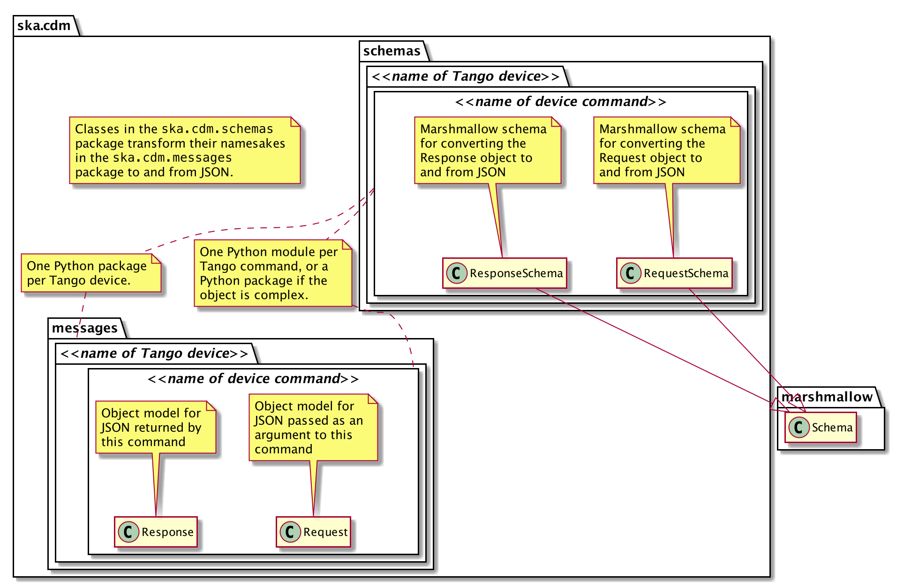
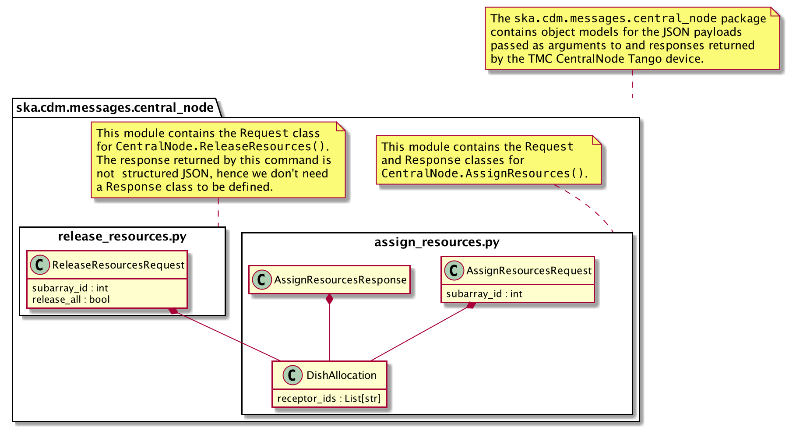
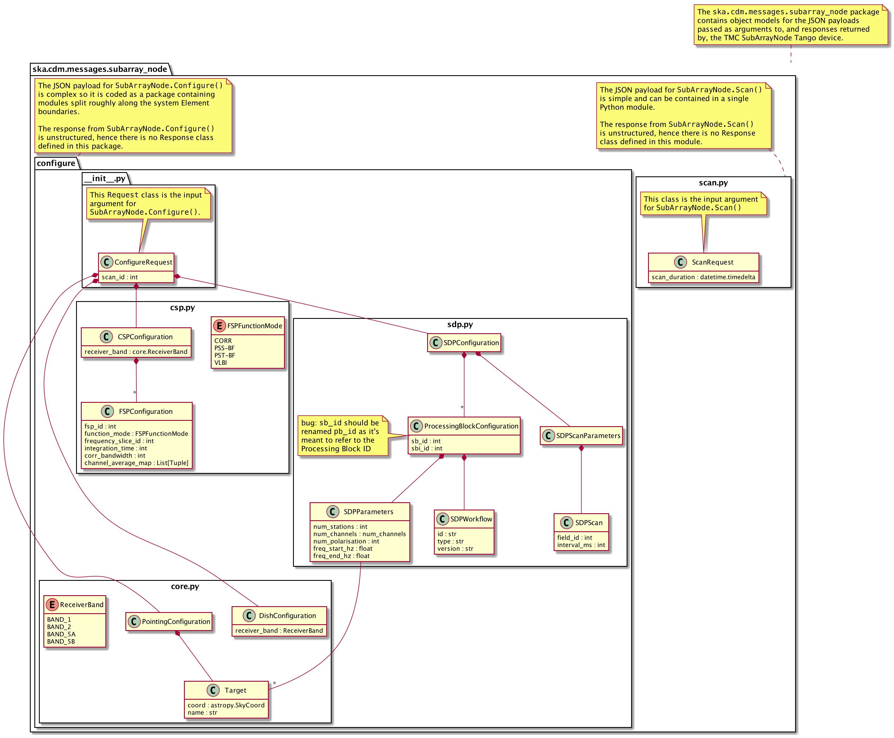
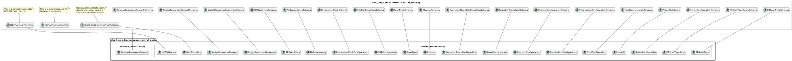
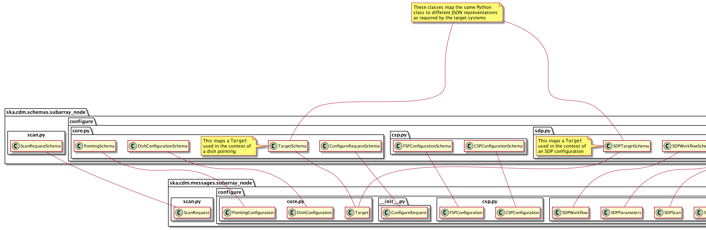

.. _`Developer Documentation`:

=======================
Developer Documentation
=======================

Quickstart
==========

This project uses Docker containers for development and testing, and ``make``
to provide a consistent UI.

Build a new Docker image and execute the test suite with:

::

  make test

Launch an interactive shell inside a container, with your workspace visible
inside the container, with:

::

  make interactive

To list all available targets, execute ``make`` without any arguments, e.g.,

::

  equuleus:cdm-shared-library $ make
  build                          build the application image
  down                           stop develop/test environment and any interactive session
  help                           show this help.
  interactive                    start an interactive session using the project image (caution: R/W mounts source directory to /app)
  lint                           lint the application (static code analysis)
  piplock                        overwrite Pipfile.lock with the image version
  pull                           download the application image
  push                           push the image to the Docker registry
  test                           test the application
  up                             start develop/test environment

Background
==========

SKA Tango devices have commands that accept structured arguments and/or return
structured responses. These structured data are often expressed as
JSON-formatted strings.

The Configuration Data Model (CDM) is a data model used to describe subarray
resource allocations and the subsequent configuration of those resources. It
is effectively the superset of the configurations used by receptors,
correlators, and data processing systems. The CDM is one such example of
structured data delivered to TMC Tango devices.

This project defines object representations of the structured data passed to
and from Tango devices, and serialisation schema used to convert the
structured data to and from JSON. This project defines:

#. a Python object model of the CDM;
#. a Python object model for the structured arguments sent to TMC Tango
   devices and the structured responses received in return;
#. serialisation schema to convert the Python object model instances to and
   from JSON.

The primary users of this shared library are the OET, SubArrayNode, and
CentralNode. The OET uses this library to construct object representations of
telescope configurations and resource allocation instructions, to convert
those object representations to JSON-formatted payloads for TMC devices, and
finally to convert the JSON responses returned by TMC devices back into Python
objects.

It is intended that TMC devices also use this library to guarantee
correct data exchange with the OET. TMC can also use this library to marshall
and unmarshall its arguments to CSP and SDP Tango devices, which accept the
appropriate subset of the JSON.

Project layout
==============

The CDM project contains two top-level packages, ``ska.cdm.messages`` and
``ska.cdm.schemas`` as shown in the figure below. The ``ska.cdm.messages``
package contains Python object models for the JSON command arguments agreed
in the ICDs. The ``ska.cdm.schemas`` package contains code to transform the
classes defined in ``ska.cdm.messages`` to and from JSON.

   Project layout and naming conventions.

The project layout and naming conventions are:

* Each Tango device has a corresponding Python sub-package in
  ``ska.cdm.messages`` and ``ska.cdm.schemas``.
* Code and schema for each Tango device command are located in Python modules
  inside their respective package.
* Structured input for the Tango command is modelled by a ``Request`` object.
* Structured output from the command is modelled by a ``Response`` object.
* Marshmallow schema are created to transform Python ``Request`` and
  ``Response`` instances to an from JSON, along with any other content they
  contain.

ska.cdm.messages
----------------

The Python object model for the JSON defined in the ICD is located in the
``ska.cdm.messages`` package. In general, each CDM JSON entity is represented
as a Python class and each CDM attribute presented as a class property. CDM
attributes can be typed as plain Python data types (strings, floats, etc.) or,
where appropriate, represented by rich objects if this provides additional
value to the client. For example, while astronomical coordinates are
represented by floats and strings in the JSON schema, in the object model they
are defined as Astropy
`SkyCoord <https://docs.astropy.org/en/stable/api/astropy.coordinates.SkyCoord.html>`_
instances to ensure ensure correct coordinate handling and permit easier
manipulation downstream. Similarly, quantities with units could be defined as
instances of Astropy
`Quantity <https://docs.astropy.org/en/stable/units/quantity.html>`_ to
provide additional functionality.

TMC CentralNode
^^^^^^^^^^^^^^^

Sub-array resource allocation and de-allocation is performed via communication
with a TMC CentralNode device. The diagram below shows how the object model
used for resource allocation and de-allocation commands.

   Object model for communication with TMC CentralNode device.

This model is used to represent a JSON request such as this PI#3 example:

.. code-block:: JSON

  {
    "subarrayID": 1,
    "dish": {
      "receptorIDList": ["0001", "0002"]
    }
  }

TMC SubArrayNode
^^^^^^^^^^^^^^^^

Sub-array configuration and control is achieved via communication with a TMC
SubArrayNode device. The diagram below shows how the object model used for
telescope configuration and control.

   Object model for communication with TMC SubArrayNode device.

This model is used to represent a JSON request such as this example from PI#3:

.. code-block:: JSON

  {
    "scanID": 12345,
    "pointing": {
      "target": {
        "system":"ICRS",
        "name": "NGC6251",
        "RA": 1.0,
        "dec": 1.0
      },
    },
    "dish": {
      "receiverBand": "1"
    },
    "csp": {
      "frequencyBand": "1",
      "fsp": [
        {
          "fspID": 1,
          "functionMode": "CORR",
          "frequencySliceID": 1,
          "integrationTime": 1400,
          "corrBandwidth": 0,
          "channelAveragingMap": [
            [1,2], [745,0], [1489,0], [2233,0], [2977,0], [3721,0], [4465,0],
            [5209,0], [5953,0], [6697,0], [7441,0], [8185,0], [8929,0], [9673,0],
            [10417,0], [11161,0], [11905,0], [12649,0], [13393,0], [14137,0]
          ],
        },
        {
          "fspID": 2,
          "functionMode": "CORR",
          "frequencySliceID": 2,
          "integrationTime": 1400,
          "corrBandwidth": 0
        },
      ]
    },
    "sdp": {
      "configure": [
        {
          "id": "realtime-20190627-0001",
          "sbiId": "20190627-0001",
          "workflow": {
            "id": "vis_ingest",
            "type": "realtime",
            "version": "0.1.0"
          },
          "parameters": {
            "numStations": 4,
            "numChanels": 372,
            "numPolarisations": 4,
            "freqStartHz": 0.35e9,
            "freqEndHz": 1.05e9,
            "fields": {
              "0": { "system": "ICRS", "name": "NGC6251", "ra": 1.0, "dec": 1.0 }
            }
          },
          "scanParameters": {
            "12345": { "fieldId": 0, "intervalMs": 1400 }
          }
        }
      ],
      "configureScan": {
        "scanParameters": {
          "12346": { "fieldId": 0, "intervalMs": 2800 }
        }
      }
    },
    "tmc": {
    }
  }

ska.cdm.schemas
---------------

Classes to marshall the ``ska.cdm.messages`` objects to and from JSON are
defined in the ``ska.cdm.schemas`` package. The cdm-shared-library project
uses `Marshmallow <http://marshmallow.org>`_ for JSON serialisation. Classes
in the ``ska.cdm.schemas`` define Marshmallow schemas which are used by
Marshmallow during JSON conversion.

   Schema mapping for objects used to communicate with TMC CentralNode device.

   Schema mapping for objects used to communicate with TMC SubArrayNode device.

Extending the CDM
=================

Additional devices and applications cay use this library to communicate CDM
elements wherever useful. Developers are encouraged to extend the
cdm-shared-library project, adding object models and schemas for the
structured arguments for their Tango devices.

The steps to extend the CDM are:

#. Create a new package for the Tango device in ``ska.cdm.messages``.
#. For each device command, create a new module in the new package.
#. If the command accepts structured input, define a ``Request`` class in the
   module.
#. If the command returns a structured response, define a ``Response`` class in
   the module.
#. With the Python object model defined, create a corresponding package and
   module structure in ``ska.cdm.schemas``.
#. In the schema module, define Marshmallow schemas to convert the object
   model classes and any structure to JSON.
#. If this is a major entity, register the schema with the
   ``ska.cdm.schemas.CODEC`` object using the ``@CODEC.register_mapping``
   decorator.
