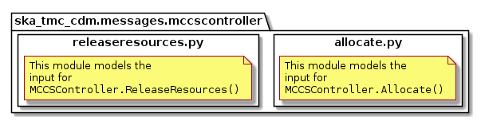
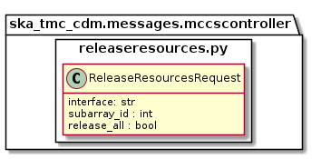

.. _`MCCSController commands`:

==============
MCCSController
==============

Overview
========

MCCS resource allocation is achieved via communication with an MCCSController
device. The ``mccscontroller`` package models the JSON input and for
MCCSController commands. The contents of this package are shown in the figure
below.

Classes in the `allocate.py`_ module model the arguments for the
``MCCSController.Allocate()`` command.

Classes in the `releaseresources.py`_ module model the arguments for the
``MCCSController.ReleaseResources()`` command.

allocate.py
===========

   allocate.py object model

The ``allocate.py`` module models the the JSON input for an
``MCCSController.Allocate()`` command.

Example JSON input modelled by ``MCCSController.Allocate``:

.. code-block:: JSON

  {
    "interface": "https://schema.skatelescope.org/ska-low-mccs-assignresources/1.0",
    "subarray_id": 1,
    "subarray_beam_ids": [1],
    "station_ids": [[1,2]],
    "channel_blocks": [3]
  }

releaseresources.py
===================

   releaseresources.py object model

The ``releaseresources.py`` module models the input JSON for a
``MCCSController.ReleaseResources()`` command.

Example ReleaseResourcesRequest JSON that requests all resources be released
from sub-array #1:

.. code-block:: JSON

  {
    "interface": "https://schema.skatelescope.org/ska-low-mccs-releaseresources/1.0",
    "subarray_id": 1,
    "release_all": true
  }
