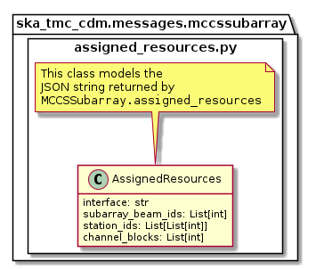

.. _`MCCSSubarray commands and attributes`:

============
MCCSSubarray
============

Overview
========

MCCS configuration and scan control is achieved via communication with a
MCCSSubarray Tango device. Additionally, the MCCSSubarray device presents
a device attribute that lists the resources allocated to that subarray.

The diagram below shows the packages and high-level object model used for
communication with an MCCSSubarray device.

   High-level object model for communication with a MCCSSubarray device.

Classes in the `assigned_resources.py`_ module model the resource allocation
status JSON string returned by the ``MCCSSubarray.assigned_resources``
attribute.

Classes in the `configure.py`_ module model the arguments for the
``MCCSSubarray.Configure()`` command.

Classes in the `scan.py`_ module model the arguments for the
``MCCSSubarray.Scan()`` command.

assigned_resources.py
=====================

   High-level overview of the assigned_resources module

The ``assigned_resources.py`` module models the the JSON returned by reading the
``MCCSSubarray.assigned_resources`` attribute.

Example JSON returned by ``MCCSSubarray.assigned_resources``:

.. code-block:: JSON

  {
    "interface": "https://schema.skao.int/ska-low-mccs-assignedresources/2.0",
    "subarray_beam_ids": [1],
    "station_ids": [[1,2]],
    "channel_blocks": [3]
  }

configure.py
============

   High-level overview of the configure module

The ``configure.py`` module models the the JSON input for an
``MCCSSubarray.configure()`` command.

Example JSON input for an ``MCCSSubarray.Configure`` call:

.. code-block:: JSON

  {
    "interface": "https://schema.skao.int/ska-low-mccs-configure/2.0",
    "stations":[
      {
        "station_id": 1
      },
      {
        "station_id":2
      }
    ],
    "subarray_beams": [
      {
        "subarray_beam_id":1,
        "station_ids": [1, 2],
        "update_rate": 0.0,
        "channels": [
          [0,8,1,1],
          [8,8,2,1],
          [24,16,2,1]
        ],
        "sky_coordinates": [0.0, 180.0, 0.0, 45.0, 0.0],
        "antenna_weights": [1.0, 1.0, 1.0],
        "phase_centre": [0.0, 0.0]
      }
    ]
  }

scan.py
=======

   scan.py object model

The ``scan.py`` module models the argument for the ``MCCSSubarray.scan()``
command.

Example JSON input for an ``MCCSSubarray.scan()`` call:

.. code-block:: JSON

  {
    "interface": "https://schema.skao.int/ska-low-mccs-scan/2.0",
    "scan_id":1,
    "start_time": 0.0
  }
