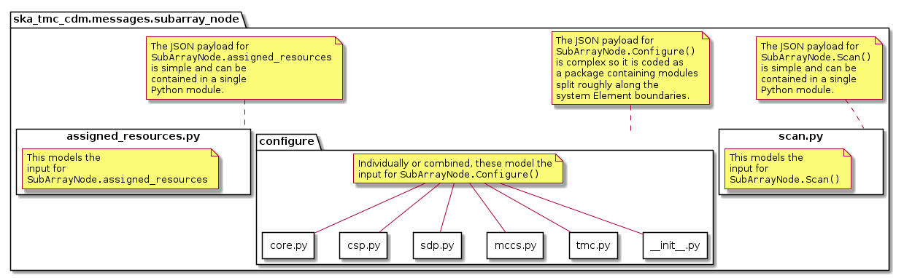
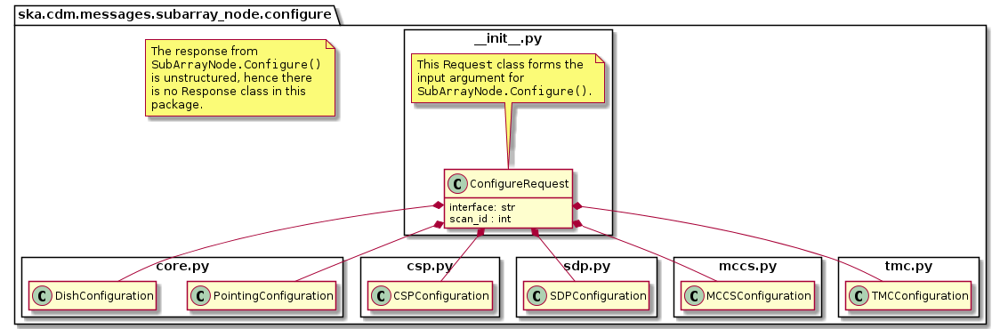
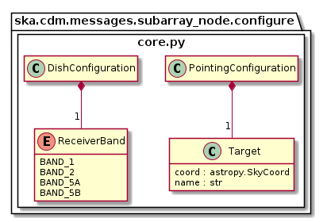
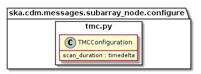
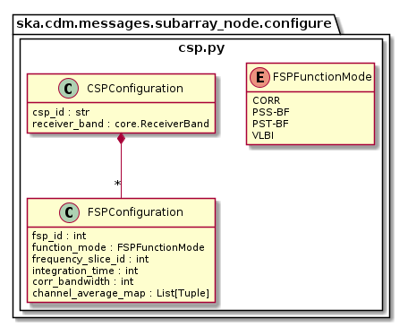
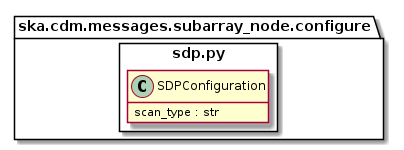
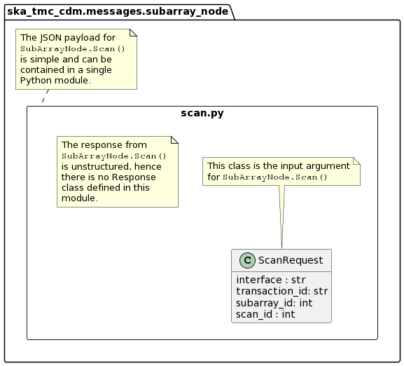

.. _`SubArrayNode commands`:

================
TMC SubArrayNode
================

Overview
========

Sub-array configuration and scan control is achieved via communication with a
TMC SubArrayNode Tango device. The diagram below shows the packages and
high-level object model used for telescope configuration and control.

   High-level object model for communication with a TMC SubArrayNode device.

Classes in the `configure`_ package model the arguments for the
``SubArrayNode.Configure()`` command.

Classes in the `scan.py`_ module model the arguments for the
``SubArrayNode.Scan()`` command.

configure
=========

   High-level overview of the configure package

The configuration JSON is complex, the module is split between several
modules. The ``configure`` package contains five modules:

* __init__.py
* `core.py`_
* `tmc.py`_
* `csp.py`_
* `sdp.py`_
* `mccs.py`_

``__init__.py`` references sub-modules in the main ConfigureRequest object, as
illustrated in the diagram above.

In the context of a full JSON example object, __init__.py defines the a basic
container object, while the sub-modules define the details.

.. code::

  # JSON modelled specifically by __init__.py
  {
    "scanID": 12345,
    ...
  }

core.py
-------

   core.py object model

The ``core.py`` module models receptor pointing and receiver band JSON
elements. In the context of a full CDM JSON object, the elements this maps to
are:

.. code::

  # JSON modelled specifically by core.py
  {
    ...
    "pointing": {
      "target": {
        "system":"ICRS",
        "name": "NGC6251",
        "RA": 1.0,
        "dec": 1.0
      },
    },
    ...
    "dish": {
      "receiverBand": "1"
    }
    ....
  }

tmc.py
------

   tmc.py object model

The ``tmc.py`` module models TMC configuration JSON elements. Below is an
example JSON command argument that this code can model.

.. code::

  # JSON modelled specifically by tmc.py
  {
    "tmc": {
      "scanDuration": 10.0,
    }
  }

csp.py
------

   csp.py object model

The ``csp.py`` module models CSP configuration JSON elements. In the context
of a full CDM JSON object, the elements this maps to are:

.. code::

  # JSON modelled specifically by csp.py
  {
    ...
    "csp": {
      "interface": "https://schema.skatelescope.org/ska-csp-configure/1.0",
      "subarray": {
        "subarrayName": "science period 23"
      },
      "common": {
        "id": "sbi-mvp01-20200325-00001-science_A",
        "frequencyBand": "1",
        "subarrayID": 1
      },
      "cbf": {
        "fsp": [
          {
            "fspID": 1,
            "functionMode": "CORR",
            "frequencySliceID": 1,
            "integrationTime": 1400,
            "outputLinkMap": [[0,0], [200,1]],
            "corrBandwidth": 0,
            "channelAveragingMap": [[0, 2], [744, 0]],
            "fspChannelOffset": 0
          },
          {
            "fspID": 2,
            "functionMode": "CORR",
            "frequencySliceID": 2,
            "integrationTime": 1400,
            "corrBandwidth": 1,
            "outputLinkMap": [[0,4], [200,5]],
            "channelAveragingMap": [[0, 2], [744, 0]],
            "fspChannelOffset": 744,
            "zoomWindowTuning": 4700000
          }
        ]
      }
    },
    ...
  }

sdp.py
------

   sdp.py object model

The ``sdp.py`` module models SDHP configuration JSON elements. In the context
of a full CDM JSON object, the elements this maps to are:

.. code::

  # JSON modelled specifically by sdp.py
  {
    ...
    "sdp": {
      "scan_type": "science_A"
    },
    ...
  }

mccs.py
-------

.. figure:: mccs.png
   :align: center
   :alt: mccs.py object model

   mccs.py object model

The ``mccs.py`` module models MCCS configuration JSON elements. In the context
of a full CDM JSON object, the elements this maps to are:

.. code::

  # JSON modelled specifically by mccs.py
  {
    "mccs": {
        "stations": [
          {
            "station_id": 1
          },
          {
            "station_id": 2
          }
        ],
        "subarray_beams": [
          {
            "subarray_beam_id": 1,
            "station_ids": [
              1,
              2
            ],
            "update_rate": 0,
            "channels": [
              [
                0,
                8,
                1,
                1
              ],
              [
                8,
                8,
                2,
                1
              ],
              [
                24,
                16,
                2,
                1
              ]
            ],
            "antenna_weights": [
              1,
              1,
              1
            ],
            "phase_centre": [
              0,
              0
            ],
            "target": {
              "system": "HORIZON",
              "name": "DriftScan",
              "az": 180,
              "el": 45
            }
          }
        ]
     }
  }

In addition there is a device attribute MCCSAssignedResources that describes which resources have been assigned to the sub-array.
Examples below depict a populated sub-array and an empty one:

.. code:: JSON

    {
        "interface": "https://schema.skatelescope.org/ska-low-tmc-assignedresources/1.0",
        "mccs": {
            "subarray_beam_ids": [1],
            "station_ids": [[1,2]],
            "channel_blocks": [3]
        }
    }

.. code:: JSON

    {
        "interface": "https://schema.skatelescope.org/ska-low-tmc-assignedresources/1.0",
        "mccs": {
            "subarray_beam_ids": [],
            "station_ids": [],
            "channel_blocks": []
        }
    }

scan.py
=======

   scan.py object model

The ``scan.py`` module models the argument for the ``SubArrayNode.scan()`` command.
Below is an example JSON command argument that this code can model.

.. code-block:: JSON

  {
    "id": 2
  }

Example scan JSON for LOW

.. code-block:: JSON

  {
    "interface": "https://schema.skatelescope.org/ska-low-tmc-scan/1.0",
    "scan_id": 1
  }

Example configuration JSON for MID
==================================

.. code-block:: JSON

  {
    "pointing": {
      "target": {
        "system":"ICRS",
        "name": "NGC1068",
        "RA": 0.70984,
        "dec": 0.000233
      },
    },
    "dish": {
      "receiverBand": "1"
    },
    "csp": {
      "interface": "https://schema.skatelescope.org/ska-csp-configure/1.0",
      "subarray": {
        "subarrayName": "science period 23"
      },
      "common": {
        "id": "sbi-mvp01-20200325-00001-science_A",
        "frequencyBand": "1",
        "subarrayID": 1
      },
      "cbf": {
        "fsp": [
          {
            "fspID": 1,
            "functionMode": "CORR",
            "frequencySliceID": 1,
            "integrationTime": 1400,
            "outputLinkMap": [[0,0], [200,1]],
            "corrBandwidth": 0,
            "channelAveragingMap": [[0, 2], [744, 0]],
            "fspChannelOffset": 0
          },
          {
            "fspID": 2,
            "functionMode": "CORR",
            "frequencySliceID": 2,
            "integrationTime": 1400,
            "corrBandwidth": 1,
            "outputLinkMap": [[0,4], [200,5]],
            "channelAveragingMap": [[0, 2], [744, 0]],
            "fspChannelOffset": 744,
            "zoomWindowTuning": 4700000
          }
        ]
      }
    },
    "sdp": {
      "scan_type": "science_A"
    },
    "tmc": {
      "scanDuration": 10.0,
    }
  }

Example configuration JSON for LOW
==================================

.. code-block:: JSON

    {
      "interface": "https://schema.skatelescope.org/ska-low-tmc-configure/1.0",
      "mccs": {
        "stations":[
          {
            "station_id": 1
          },
          {
            "station_id":2
          }
        ],
        "subarray_beams": [
          {
            "subarray_beam_id": 1,
            "station_ids": [1, 2],
            "update_rate": 0.0,
            "channels": [
              [0,8,1,1],
              [8,8,2,1],
              [24,16,2,1]
            ],
            "antenna_weights": [1.0, 1.0, 1.0],
            "phase_centre": [0.0, 0.0],
            "target": {
              "system": "HORIZON",
              "name": "DriftScan",
              "az": 180.0,
              "el": 45.0
            }
          }
        ]
      },
      "sdp": {
        // TMC can ignore any SDP spec this PI
      },
      "tmc": {
        "scan_duration": 10.0
      }
    }

