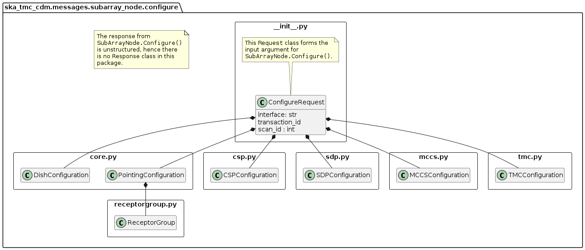
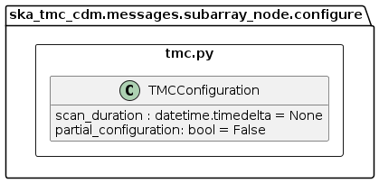
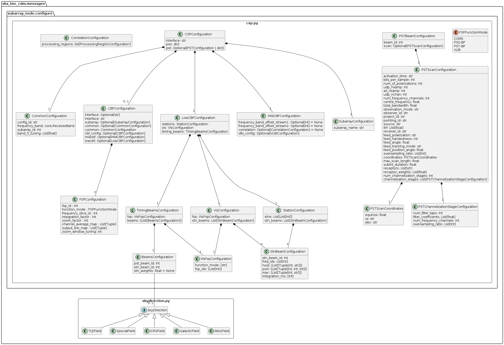

.. _`SubArrayNode commands`:

================
TMC SubArrayNode
================

Overview
========

Sub-array configuration and scan control is achieved via communication with a
TMC SubArrayNode Tango device. The diagram below shows the packages and
high-level object model used for telescope configuration and control.

.. figure:: subarraynode.png
   :align: center
   :alt: High-level overview of SubArrayNode packages and classes

   High-level object model for communication with a TMC SubArrayNode device.

Classes in the `configure`_ package model the arguments for the
``SubArrayNode.Configure()`` command.

Classes in the `scan.py`_ module model the arguments for the
``SubArrayNode.Scan()`` command.

configure
=========

   High-level overview of the configure package

The configuration JSON is complex, the module is split between several
modules. The ``configure`` package contains five modules:

* __init__.py
* `core.py`_
* `tmc.py`_
* `csp.py`_
* `sdp.py`_
* `mccs.py`_

``__init__.py`` references sub-modules in the main ConfigureRequest object, as
illustrated in the diagram above.

In the context of a full JSON example object, __init__.py defines the a basic
container object, while the sub-modules define the details.

.. code::

  # JSON modelled specifically by __init__.py
  {
    "scanID": 12345,
    ...
  }

core.py
-------

.. figure:: core.png
   :align: center
   :alt: core.py object model

   core.py object model

The ``core.py`` module models receptor pointing and receiver band JSON
elements. In the context of a full CDM JSON object, the elements this maps to
are:

.. code::

  # JSON modelled specifically by core.py
  {
    ...
    "pointing": {
      "target": {
        "reference_frame":"ICRS",
        "name": "NGC6251",
        "ra": 1.0,
        "dec": 1.0
      },
    },
    ...
    "dish": {
      "receiver_band": "1"
    }
    ....
  }

tmc.py
------

   tmc.py object model

The ``tmc.py`` module models TMC configuration JSON elements. Below is an
example JSON command argument that this code can model.

.. code::

  # JSON modelled specifically by tmc.py
  {
    "tmc": {
      "scan_duration": 10.0,
    }
  }

csp.py
------

   csp.py object model

The ``csp.py`` module models CSP configuration JSON elements. In the context
of a full CDM JSON object, the elements this maps to are:

.. code::

  #Mid JSON specifically by csp.py
  {
    ...
    csp": {
    "interface": "https://schema.skao.int/ska-csp-configure/2.0",
    "subarray": {
      "subarray_name": "science period 23"
    },
    "common": {
      "config_id": "sbi-mvp01-20200325-00001-science_A",
      "frequency_band": "1",
      "subarray_id": 1
    },
    "cbf": {
      "fsp": [
        {
          "fsp_id": 1,
          "function_mode": "CORR",
          "frequency_slice_id": 1,
          "integration_factor": 1,
          "zoom_factor": 0,
          "channel_averaging_map": [
            [
              0,
              2
            ],
            [
              744,
              0
            ]
          ],
          "channel_offset": 0,
          "output_link_map": [
            [
              0,
              0
            ],
            [
              200,
              1
            ]
          ]
        },
        {
          "fsp_id": 2,
          "function_mode": "CORR",
          "frequency_slice_id": 2,
          "integration_factor": 1,
          "zoom_factor": 1,
          "channel_averaging_map": [
            [
              0,
              2
            ],
            [
              744,
              0
            ]
          ],
          "channel_offset": 744,
          "output_link_map": [
            [
              0,
              4
            ],
            [
              200,
              5
            ]
          ],
          "zoom_window_tuning": 650000
        }
      ],
      "vlbi": {

      }
    },
    "pss": {

    },
    "pst": {

    },
   },
    ...
  }

  #Low JSON  specifically by csp.py
  
    "csp": {
              "interface": "https://schema.skao.int/ska-low-csp-configure/3.2",
              "common": {
                  "config_id": "sbi-mvp01-20200325-00001-science_A",
                  "eb_id": "eb-test-20220916-00000"
              },
              "lowcbf": {
                  "stations": {
                      "stns": [[1, 1], [2, 1], [3, 1], [4, 1], [5, 1], [6, 1]],
                      "stn_beams": [{"beam_id": 1, "freq_ids": [400]}]
                  },
                  "vis": {
                      "fsp": {"firmware": "vis", "fsp_ids": [1]},
                      "stn_beams": [
                          {
                              "stn_beam_id": 1,
                              "integration_ms": 849
                          }
                      ]
                  },
                  "timing_beams": {
                      "fsp": {"firmware": "pst", "fsp_ids": [2]},
                      "beams": [
                          {
                              "pst_beam_id": 1,
                              "stn_beam_id": 1,
                              "stn_weights": [0.9, 1.0, 1.0, 1.0, 0.9, 1.0]
                          }
                      ]
                  }
              },
            "pst": {
              "beams": [
                  {
                      "beam_id": 1,
                      "scan": {
                          "activation_time": "2022-01-19T23:07:45Z",
                          "bits_per_sample": 32,
                          "num_of_polarizations": 2,
                          "udp_nsamp": 32,
                          "wt_nsamp": 32,
                          "udp_nchan": 24,
                          "num_frequency_channels": 432,
                          "centre_frequency": 200000000.0,
                          "total_bandwidth": 1562500.0,
                          "observation_mode": "VOLTAGE_RECORDER",
                          "observer_id": "jdoe",
                          "project_id": "project1",
                          "pointing_id": "pointing1",
                          "source": "J1921+2153",
                          "itrf": [5109360.133, 2006852.586, -3238948.127],
                          "receiver_id": "receiver3",
                          "feed_polarization": "LIN",
                          "feed_handedness": 1,
                          "feed_angle": 1.234,
                          "feed_tracking_mode": "FA",
                          "feed_position_angle": 10.0,
                          "oversampling_ratio": [8, 7],
                          "coordinates": {
                              "equinox": 2000.0,
                              "ra": "19:21:44.815",
                              "dec": "21:53:02.400"
                          },
                          "max_scan_length": 20000.0,
                          "subint_duration": 30.0,
                          "receptors": ["receptor1", "receptor2"],
                          "receptor_weights": [0.4, 0.6],
                          "num_channelization_stages": 2,
                          "channelization_stages": [
                              {
                                  "num_filter_taps": 1,
                                  "filter_coefficients": [1.0],
                                  "num_frequency_channels": 1024,
                                  "oversampling_ratio": [32, 27]
                              },
                              {
                                  "num_filter_taps": 1,
                                  "filter_coefficients": [1.0],
                                  "num_frequency_channels": 256,
                                  "oversampling_ratio": [4, 3]
                              }
                          ]
                      }
                  }
              ]
        }

sdp.py
------

.. figure:: sdp.png
   :align: center
   :alt: sdp.py object model

   sdp.py object model

The ``sdp.py`` module models SDHP configuration JSON elements. In the context
of a full CDM JSON object, the elements this maps to are:

.. code::

  # JSON modelled specifically by sdp.py
  {
    ...
    "sdp": {
      "scan_type": "science_A"
    },
    ...
  }

mccs.py
-------

.. figure:: mccs.png
   :align: center
   :alt: mccs.py object model

   mccs.py object model

The ``mccs.py`` module models MCCS configuration JSON elements. In the context
of a full CDM JSON object, the elements this maps to are:

.. code::

  # JSON modelled specifically by mccs.py
  {
      "interface": "https://schema.skao.int/ska-low-tmc-assignedresources/4.0",
      "mccs": {
          "interface": "https://schema.skao.int/ska-low-mccs-controller-allocate/3.0"
          "subarray_beams": [
              {
                  "subarray_beam_id": 1,
                  "apertures": [
                      {
                          "station_id": 1,
                          "aperture_id": "AP001.01",
                      },
                  ],
                  "number_of_channels": 8,
              },
          ]
      }
  }

assigned_resources.py
=====================

.. figure:: assignedresources.png
   :align: center
   :alt: assigned_resources.py object model

   assigned_resources.py object model

The ``assigned_resources.py`` module describes which resources have been assigned to the sub-array.

Examples below depict a populated sub-array and an empty one:

.. code:: JSON

    {
        "interface": "https://schema.skao.int/ska-low-tmc-assignedresources/2.0",
        "mccs": {
            "subarray_beam_ids": [1],
            "station_ids": [[1,2]],
            "channel_blocks": [3]
        }
    }

.. code:: JSON

    {
        "interface": "https://schema.skao.int/ska-low-tmc-assignedresources/2.0",
        "mccs": {
            "subarray_beam_ids": [],
            "station_ids": [],
            "channel_blocks": []
        }
    }

scan.py
=======

.. figure:: scan.png
   :align: center
   :alt: scan.py object model

   scan.py object model

The ``scan.py`` module models the argument for the ``SubArrayNode.scan()`` command.
Below is an example JSON command argument that this code can model.

.. code-block:: JSON

  // For MID
  {
    "interface": "https://schema.skao.int/ska-tmc-scan/2.1",
    "transaction_id": "txn-12345",
    "scan_id": 2
  }

  // For LOW
  {
    "interface": "https://schema.skao.int/ska-low-tmc-scan/4.0",
    "transaction_id": "txn-....-00001",
    "subarray_id": 1,
    "scan_id": 1
  }

Example configuration JSON for MID
==================================

.. code-block:: JSON

    {
      "interface": "https://schema.skao.int/ska-tmc-configure/2.1",
      "transaction_id": "txn-....-00001",
      "pointing": {
        "target": {
          "reference_frame": "ICRS",
          "target_name": "Polaris Australis",
          "ra": "21:08:47.92",
          "dec": "-88:57:22.9"
        }
      },
      "dish": {
        "receiver_band": "1"
      },
      "csp": {
        "interface": "https://schema.skao.int/ska-csp-configure/2.0",
        "subarray": {
          "subarray_name": "science period 23"
        },
        "common": {
          "config_id": "sbi-mvp01-20200325-00001-science_A",
          "frequency_band": "1",
          "subarray_id": 1
        },
        "cbf": {
          "fsp": [
            {
              "fsp_id": 1,
              "function_mode": "CORR",
              "frequency_slice_id": 1,
              "integration_factor": 1,
              "zoom_factor": 0,
              "channel_averaging_map": [
                [
                  0,
                  2
                ],
                [
                  744,
                  0
                ]
              ],
              "channel_offset": 0,
              "output_link_map": [
                [
                  0,
                  0
                ],
                [
                  200,
                  1
                ]
              ]
            },
            {
              "fsp_id": 2,
              "function_mode": "CORR",
              "frequency_slice_id": 2,
              "integration_factor": 1,
              "zoom_factor": 1,
              "channel_averaging_map": [
                [
                  0,
                  2
                ],
                [
                  744,
                  0
                ]
              ],
              "channel_offset": 744,
              "output_link_map": [
                [
                  0,
                  4
                ],
                [
                  200,
                  5
                ]
              ],
              "zoom_window_tuning": 650000
            }
          ],
          "vlbi": {

          }
        },
        "pss": {

        },
        "pst": {

        }
      },
      "sdp": {
        "interface": "https://schema.skao.int/ska-sdp-configure/0.4",
        "scan_type": "science_A"
      },
      "tmc": {
        "scan_duration": 10.0
      }
    }

Example configuration JSON for LOW
==================================

.. code-block:: JSON

    {
        "interface": "https://schema.skao.int/ska-low-tmc-configure/4.0",
        "transaction_id": "txn-....-00001",
        "mccs": {
            "subarray_beams": [
                {
                    "subarray_beam_id": 1,
                    "update_rate": 0.0,
                    "logical_bands": [
                        {"start_channel": 80, "number_of_channels": 16},
                        {"start_channel": 384, "number_of_channels": 16},
                    ],
                    "apertures": [
                        {
                            "aperture_id": "AP001.01",
                            "weighting_key_ref": "aperture2",
                        },
                        {
                            "aperture_id": "AP001.02",
                            "weighting_key_ref": "aperture3",
                        },
                        {
                            "aperture_id": "AP002.01",
                            "weighting_key_ref": "aperture2",
                        },
                        {
                            "aperture_id": "AP002.02",
                            "weighting_key_ref": "aperture3",
                        },
                        {
                            "aperture_id": "AP003.01",
                            "weighting_key_ref": "aperture1",
                        },
                    ],
                    "sky_coordinates": {
                        "reference_frame": "ICRS",
                        "c1": 180.0,
                        "c2": 45.0,
                    },
                }
            ]
        },
        "sdp": {
            "interface": "https://schema.skao.int/ska-sdp-configure/0.4",
            "scan_type": "target:a",
        },
        "csp": {
            "interface": "https://schema.skao.int/ska-low-csp-configure/3.2",
            "common": {
                "config_id": "sbi-mvp01-20200325-00001-science_A",
                "eb_id": "eb-test-20220916-00000",
            },
            "lowcbf": {
                "stations": {
                    "stns": [[1, 1], [2, 1], [3, 1], [4, 1], [5, 1], [6, 1]],
                    "stn_beams": [{"beam_id": 1, "freq_ids": [400]}],
                },
                "vis": {
                    "fsp": {"firmware": "vis", "fsp_ids": [1]},
                    "stn_beams": [{"stn_beam_id": 1, "integration_ms": 849}],
                },
                "timing_beams": {
                    "fsp": {"firmware": "pst", "fsp_ids": [2]},
                    "beams": [
                        {
                            "pst_beam_id": 1,
                            "stn_beam_id": 1,
                            "stn_weights": [0.9, 1.0, 1.0, 1.0, 0.9, 1.0],
                        }
                    ],
                },
            },
            "pst": {
                "beams": [
                    {
                        "beam_id": 1,
                        "scan": {
                            "activation_time": "2022-01-19T23:07:45Z",
                            "bits_per_sample": 32,
                            "num_of_polarizations": 2,
                            "udp_nsamp": 32,
                            "wt_nsamp": 32,
                            "udp_nchan": 24,
                            "num_frequency_channels": 432,
                            "centre_frequency": 200000000.0,
                            "total_bandwidth": 1562500.0,
                            "observation_mode": "VOLTAGE_RECORDER",
                            "observer_id": "jdoe",
                            "project_id": "project1",
                            "pointing_id": "pointing1",
                            "source": "J1921+2153",
                            "itrf": [5109360.133, 2006852.586, -3238948.127],
                            "receiver_id": "receiver3",
                            "feed_polarization": "LIN",
                            "feed_handedness": 1,
                            "feed_angle": 1.234,
                            "feed_tracking_mode": "FA",
                            "feed_position_angle": 10.0,
                            "oversampling_ratio": [8, 7],
                            "coordinates": {
                                "equinox": 2000.0,
                                "ra": "19:21:44.815",
                                "dec": "21:53:02.400",
                            },
                            "max_scan_length": 20000.0,
                            "subint_duration": 30.0,
                            "receptors": ["receptor1", "receptor2"],
                            "receptor_weights": [0.4, 0.6],
                            "num_channelization_stages": 2,
                            "channelization_stages": [
                                {
                                    "num_filter_taps": 1,
                                    "filter_coefficients": [1.0],
                                    "num_frequency_channels": 1024,
                                    "oversampling_ratio": [32, 27],
                                },
                                {
                                    "num_filter_taps": 1,
                                    "filter_coefficients": [1.0],
                                    "num_frequency_channels": 256,
                                    "oversampling_ratio": [4, 3],
                                },
                            ],
                        },
                    }
                ]
            },
        },
        "tmc": {"scan_duration": 10.0},
    }