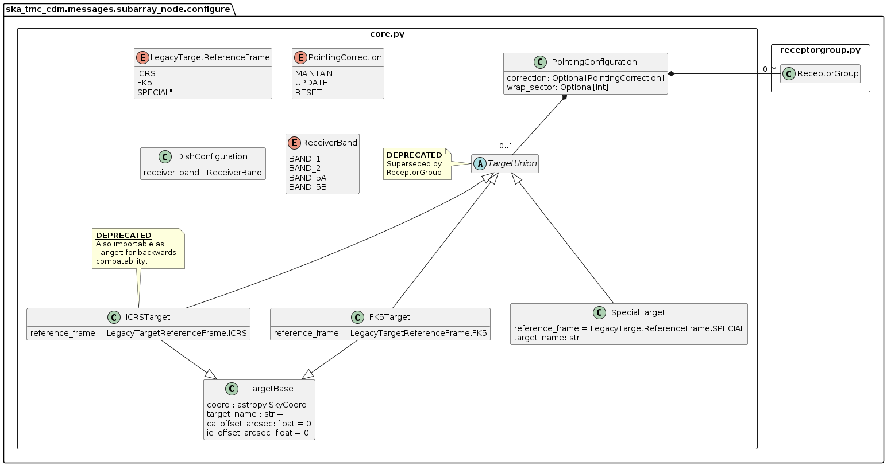
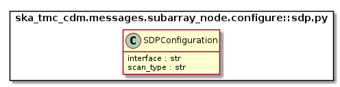

.. _`SubArrayNode commands`:

================
TMC SubArrayNode
================

Overview
========

Sub-array configuration and scan control is achieved via communication with a
TMC SubArrayNode Tango device. The diagram below shows the packages and
high-level object model used for telescope configuration and control.

.. figure:: subarraynode.png
   :align: center
   :alt: High-level overview of SubArrayNode packages and classes

   High-level object model for communication with a TMC SubArrayNode device.

Classes in the `configure`_ package model the arguments for the
``SubArrayNode.Configure()`` command.

Classes in the `scan.py`_ module model the arguments for the
``SubArrayNode.Scan()`` command.

configure
=========

.. figure:: init.png
   :align: center
   :alt: Overview of the configure package

   High-level overview of the configure package

The configuration JSON is complex, the module is split between several
modules. The ``configure`` package contains four modules:

* __init__.py
* `core.py`_
* `csp.py`_
* `sdp.py`_

``__init__.py`` references sub-modules in the main ConfigureRequest object, as
illustrated in the diagram above.

In the context of a full JSON example object, __init__.py defines the a basic
container object, while the sub-modules define the details.

.. code-block::

  # JSON modelled specifically by __init__.py
  {
    "scanID": 12345,
    ...
  }

core.py
-------

   core.py object model

The ``core.py`` module models receptor pointing and receiver band JSON
elements. In the context of a full CDM JSON object, the elements this maps to
are:

.. code-block::

  # JSON modelled specifically by core.py
  {
    ...
    "pointing": {
      "target": {
        "system":"ICRS",
        "name": "NGC6251",
        "RA": 1.0,
        "dec": 1.0
      },
    },
    ...
    "dish": {
      "receiverBand": "1"
    }
    ....
  }

csp.py
------

.. figure:: csp.png
   :align: center
   :alt: csp.py object model

   csp.py object model

The ``csp.py`` module models CSP configuration JSON elements. In the context
of a full CDM JSON object, the elements this maps to are:

.. code-block::

  # JSON modelled specifically by csp.py
  {
    ...
    "csp": {
      "frequencyBand": "1",
      "fsp": [
        {
          "fspID": 1,
          "functionMode": "CORR",
          "frequencySliceID": 1,
          "integrationTime": 1400,
          "corrBandwidth": 0,
          "channelAveragingMap": [
            [1,2], [745,0], [1489,0], [2233,0], [2977,0], [3721,0], [4465,0],
            [5209,0], [5953,0], [6697,0], [7441,0], [8185,0], [8929,0], [9673,0],
            [10417,0], [11161,0], [11905,0], [12649,0], [13393,0], [14137,0]
          ],
        }
      ]
    },
    ...
  }

sdp.py
------

   sdp.py object model

The ``sdp.py`` module models SDHP configuration JSON elements. In the context
of a full CDM JSON object, the elements this maps to are:

.. code-block::

  # JSON modelled specifically by sdp.py
  {
    ...
    "sdp": {
      "configure": [
        {
          "id": "realtime-20190627-0001",
          "sbiId": "20190627-0001",
          "workflow": {
            "id": "vis_ingest",
            "type": "realtime",
            "version": "0.1.0"
          },
          "parameters": {
            "numStations": 4,
            "numChanels": 372,
            "numPolarisations": 4,
            "freqStartHz": 0.35e9,
            "freqEndHz": 1.05e9,
            "fields": {
              "0": { "system": "ICRS", "name": "NGC6251", "ra": 1.0, "dec": 1.0 }
            }
          },
          "scanParameters": {
            "12345": { "fieldId": 0, "intervalMs": 1400 }
          }
        }
      ],
      "configureScan": {
        "scanParameters": {
          "12346": { "fieldId": 0, "intervalMs": 2800 }
        }
      }
    },
    ...
  }

scan.py
=======

.. figure:: scan.png
   :align: center
   :alt: scan.py object model

   scan.py object model

The ``scan.py`` module models the argument for the ``SubArrayNode.scan()`` command.
Below is an example JSON command argument that this code can model.

.. code-block:: JSON

  {
    "scanDuration": 10.0
  }

Example configuration JSON
==========================

.. code-block:: JSON

  {
    "scanID": 12345,
    "pointing": {
      "target": {
        "system":"ICRS",
        "name": "NGC6251",
        "RA": 1.0,
        "dec": 1.0
      },
    },
    "dish": {
      "receiverBand": "1"
    },
    "csp": {
      "frequencyBand": "1",
      "fsp": [
        {
          "fspID": 1,
          "functionMode": "CORR",
          "frequencySliceID": 1,
          "integrationTime": 1400,
          "corrBandwidth": 0,
          "channelAveragingMap": [
            [1,2], [745,0], [1489,0], [2233,0], [2977,0], [3721,0], [4465,0],
            [5209,0], [5953,0], [6697,0], [7441,0], [8185,0], [8929,0], [9673,0],
            [10417,0], [11161,0], [11905,0], [12649,0], [13393,0], [14137,0]
          ],
        },
        {
          "fspID": 2,
          "functionMode": "CORR",
          "frequencySliceID": 2,
          "integrationTime": 1400,
          "corrBandwidth": 0
        },
      ]
    },
    "sdp": {
      "configure": [
        {
          "id": "realtime-20190627-0001",
          "sbiId": "20190627-0001",
          "workflow": {
            "id": "vis_ingest",
            "type": "realtime",
            "version": "0.1.0"
          },
          "parameters": {
            "numStations": 4,
            "numChanels": 372,
            "numPolarisations": 4,
            "freqStartHz": 0.35e9,
            "freqEndHz": 1.05e9,
            "fields": {
              "0": { "system": "ICRS", "name": "NGC6251", "ra": 1.0, "dec": 1.0 }
            }
          },
          "scanParameters": {
            "12345": { "fieldId": 0, "intervalMs": 1400 }
          }
        }
      ],
      "configureScan": {
        "scanParameters": {
          "12346": { "fieldId": 0, "intervalMs": 2800 }
        }
      }
    },
    "tmc": {
    }
  }

