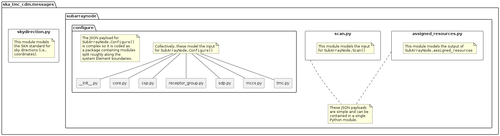
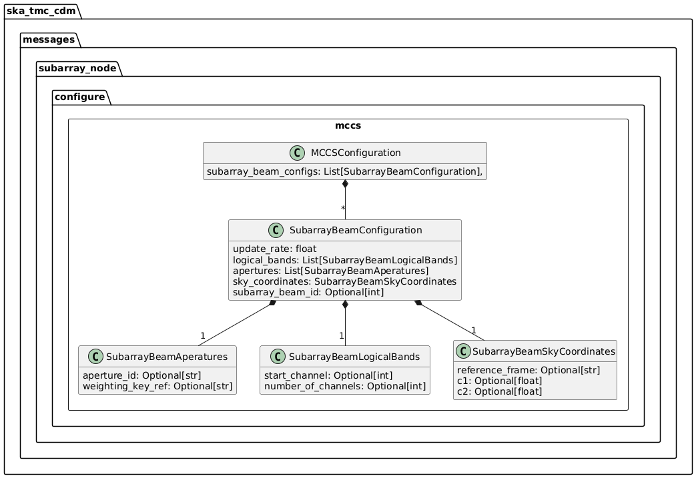

.. _`SubArrayNode commands`:

================
TMC SubArrayNode
================

Overview
========

Sub-array configuration and scan control is achieved via communication with a
TMC SubArrayNode Tango device. The diagram below shows the packages and
high-level object model used for telescope configuration and control.

   High-level object model for communication with a TMC SubArrayNode device.

Classes in the `configure`_ package model the arguments for the
``SubArrayNode.Configure()`` command.

Classes in the `scan.py`_ module model the arguments for the
``SubArrayNode.Scan()`` command.

configure
=========

.. figure:: init.png
   :align: center
   :alt: Overview of the configure package

   High-level overview of the configure package

The configuration JSON is complex, the module is split between several
modules. The ``configure`` package contains five modules:

* __init__.py
* `core.py`_
* `tmc.py`_
* `csp.py`_
* `sdp.py`_
* `mccs.py`_

``__init__.py`` references sub-modules in the main ConfigureRequest object, as
illustrated in the diagram above.

In the context of a full JSON example object, __init__.py defines the a basic
container object, while the sub-modules define the details.

.. code::

  # JSON modelled specifically by __init__.py
  {
    "scanID": 12345,
    ...
  }

core.py
-------

.. figure:: core.png
   :align: center
   :alt: core.py object model

   core.py object model

The ``core.py`` module models receptor pointing and receiver band JSON
elements. In the context of a full CDM JSON object, the elements this maps to
are:

.. code::

  # JSON modelled specifically by core.py
  {
    ...
    "pointing": {
      "target": {
        "reference_frame":"ICRS",
        "name": "NGC6251",
        "ra": 1.0,
        "dec": 1.0
      },
    },
    ...
    "dish": {
      "receiver_band": "1"
    }
    ....
  }

tmc.py
------

.. figure:: tmc.png
   :align: center
   :alt: tmc.py object model

   tmc.py object model

The ``tmc.py`` module models TMC configuration JSON elements. Below is an
example JSON command argument that this code can model.

.. code::

  # JSON modelled specifically by tmc.py
  {
    "tmc": {
      "scan_duration": 10.0,
    }
  }

csp.py
------

.. figure:: csp.png
   :align: center
   :alt: csp.py object model

   csp.py object model

The ``csp.py`` module models CSP configuration JSON elements. In the context
of a full CDM JSON object, the elements this maps to are:

.. code::

  #Mid JSON specifically by csp.py
  {
    ...
    csp": {
    "interface": "https://schema.skao.int/ska-csp-configure/2.0",
    "subarray": {
      "subarray_name": "science period 23"
    },
    "common": {
      "config_id": "sbi-mvp01-20200325-00001-science_A",
      "frequency_band": "1",
      "subarray_id": 1
    },
    "cbf": {
      "fsp": [
        {
          "fsp_id": 1,
          "function_mode": "CORR",
          "frequency_slice_id": 1,
          "integration_factor": 1,
          "zoom_factor": 0,
          "channel_averaging_map": [
            [
              0,
              2
            ],
            [
              744,
              0
            ]
          ],
          "channel_offset": 0,
          "output_link_map": [
            [
              0,
              0
            ],
            [
              200,
              1
            ]
          ]
        },
        {
          "fsp_id": 2,
          "function_mode": "CORR",
          "frequency_slice_id": 2,
          "integration_factor": 1,
          "zoom_factor": 1,
          "channel_averaging_map": [
            [
              0,
              2
            ],
            [
              744,
              0
            ]
          ],
          "channel_offset": 744,
          "output_link_map": [
            [
              0,
              4
            ],
            [
              200,
              5
            ]
          ],
          "zoom_window_tuning": 650000
        }
      ],
      "vlbi": {

      }
    },
    "pss": {

    },
    "pst": {

    },
   },
    ...
  }

  #Low JSON  specifically by csp.py
  
    "csp": {
      "interface": "https://schema.skao.int/ska-low-csp-configure/0.0",
      "common": {
        "config_id": "sbi-mvp01-20200325-00001-science_A"
      },
      "lowcbf": {
        "stations": {
          "stns": [
            [
              1,
              1
            ],
            [
              2,
              1
            ],
            [
              3,
              1
            ],
            [
              4,
              1
            ],
            [
              5,
              1
            ],
            [
              6,
              1
            ]
          ],
          "stn_beams": [
            {
              "stn_beam_id": 1,
              "freq_ids": [
                400
              ]
            }
          ]
        },
        "vis": {
          "fsp": {
            "function_mode": "vis",
            "fsp_ids": [
              1
            ]
          },
          "stn_beams": [
            {
              "stn_beam_id": 1,
              "host": [
                [
                  0,
                  "192.168.1.00"
                ]
              ],
              "port": [
                [
                  0,
                  9000,
                  1
                ]
              ],
              "mac": [
                [
                  0,
                  "02-03-04-0a-0b-0c"
                ]
              ],
              "integration_ms": 849
            }
          ]
        }
      }
    }

sdp.py
------

.. figure:: sdp.png
   :align: center
   :alt: sdp.py object model

   sdp.py object model

The ``sdp.py`` module models SDHP configuration JSON elements. In the context
of a full CDM JSON object, the elements this maps to are:

.. code::

  # JSON modelled specifically by sdp.py
  {
    ...
    "sdp": {
      "scan_type": "science_A"
    },
    ...
  }

mccs.py
-------

   mccs.py object model

The ``mccs.py`` module models MCCS configuration JSON elements. In the context
of a full CDM JSON object, the elements this maps to are:

.. code::

  # JSON modelled specifically by mccs.py
  {
    "mccs": {
        "stations": [
          {
            "station_id": 1
          },
          {
            "station_id": 2
          }
        ],
        "subarray_beams": [
          {
            "subarray_beam_id": 1,
            "station_ids": [1, 2],
            "update_rate": 0,
            "channels": [
              [0, 8, 1, 1],
              [8, 8, 2, 1],
              [24, 16, 2, 1]
            ],
            "antenna_weights": [1, 1, 1],
            "phase_centre": [0, 0],
            "target": {
              "system": "HORIZON",
              "name": "DriftScan",
              "az": 180,
              "el": 45
            }
          }
        ]
     }
  }

assigned_resources.py
=====================

.. figure:: assignedresources.png
   :align: center
   :alt: assigned_resources.py object model

   assigned_resources.py object model

The ``assigned_resources.py`` module describes which resources have been assigned to the sub-array.

Examples below depict a populated sub-array and an empty one:

.. code:: JSON

    {
        "interface": "https://schema.skao.int/ska-low-tmc-assignedresources/2.0",
        "mccs": {
            "subarray_beam_ids": [1],
            "station_ids": [[1,2]],
            "channel_blocks": [3]
        }
    }

.. code:: JSON

    {
        "interface": "https://schema.skao.int/ska-low-tmc-assignedresources/2.0",
        "mccs": {
            "subarray_beam_ids": [],
            "station_ids": [],
            "channel_blocks": []
        }
    }

scan.py
=======

.. figure:: scan.png
   :align: center
   :alt: scan.py object model

   scan.py object model

The ``scan.py`` module models the argument for the ``SubArrayNode.scan()`` command.
Below is an example JSON command argument that this code can model.

.. code-block:: JSON

  {
    "interface": "https://schema.skao.int/ska-low-tmc-scan/4.0",
    "transaction_id": "txn-....-00001",
    "subarray_id": 1,
    "scan_id": 1
  }

Example configuration JSON for MID
==================================

.. code-block:: JSON

    {
      "interface": "https://schema.skao.int/ska-tmc-configure/2.1",
      "transaction_id": "txn-....-00001",
      "pointing": {
        "target": {
          "reference_frame": "ICRS",
          "target_name": "Polaris Australis",
          "ra": "21:08:47.92",
          "dec": "-88:57:22.9"
        }
      },
      "dish": {
        "receiver_band": "1"
      },
      "csp": {
        "interface": "https://schema.skao.int/ska-csp-configure/2.0",
        "subarray": {
          "subarray_name": "science period 23"
        },
        "common": {
          "config_id": "sbi-mvp01-20200325-00001-science_A",
          "frequency_band": "1",
          "subarray_id": 1
        },
        "cbf": {
          "fsp": [
            {
              "fsp_id": 1,
              "function_mode": "CORR",
              "frequency_slice_id": 1,
              "integration_factor": 1,
              "zoom_factor": 0,
              "channel_averaging_map": [
                [
                  0,
                  2
                ],
                [
                  744,
                  0
                ]
              ],
              "channel_offset": 0,
              "output_link_map": [
                [
                  0,
                  0
                ],
                [
                  200,
                  1
                ]
              ]
            },
            {
              "fsp_id": 2,
              "function_mode": "CORR",
              "frequency_slice_id": 2,
              "integration_factor": 1,
              "zoom_factor": 1,
              "channel_averaging_map": [
                [
                  0,
                  2
                ],
                [
                  744,
                  0
                ]
              ],
              "channel_offset": 744,
              "output_link_map": [
                [
                  0,
                  4
                ],
                [
                  200,
                  5
                ]
              ],
              "zoom_window_tuning": 650000
            }
          ],
          "vlbi": {

          }
        },
        "pss": {

        },
        "pst": {

        }
      },
      "sdp": {
        "interface": "https://schema.skao.int/ska-sdp-configure/0.4",
        "scan_type": "science_A"
      },
      "tmc": {
        "scan_duration": 10.0
      }
    }

Example configuration JSON for LOW
==================================

.. code-block:: JSON

    {
  "interface": "https://schema.skao.int/ska-low-tmc-configure/3.1",
  "transaction_id": "txn-....-00001",
  "mccs": {
    "stations": [
      {
        "station_id": 1
      },
      {
        "station_id": 2
      }
    ],
    "subarray_beams": [
      {
        "subarray_beam_id": 1,
        "update_rate": 0.0,
        "logical_bands": [
          {
            "start_channel": 80,
            "number_of_channels": 16
          },
          {
            "start_channel": 384,
            "number_of_channels": 16
          }
        ],
        "apertures": [
          {
            "aperture_id": "AP001.01",
            "weighting_key_ref": "aperture2"
          },
          {
            "aperture_id": "AP001.02",
            "weighting_key_ref": "aperture3"
          },
          {
            "aperture_id": "AP002.01",
            "weighting_key_ref": "aperture2"
          },
          {
            "aperture_id": "AP002.02",
            "weighting_key_ref": "aperture3"
          },
          {
            "aperture_id": "AP003.01",
            "weighting_key_ref": "aperture1"
          }
        ],
        "sky_coordinates": {
          "timestamp": "2021-10-23T12:34:56.789Z",
          "reference_frame": "ICRS",
          "c1": 180.0,
          "c1_rate": 0.0,
          "c2": 45.0,
          "c2_rate": 0.0
        }
      }
    ]
  },
  "sdp": {
    "interface": "https://schema.skao.int/ska-sdp-configure/0.4",
    "scan_type": "science_A"
  },
  "csp": {
    "interface": "https://schema.skao.int/ska-low-csp-configure/0.0",
    "common": {
      "config_id": "sbi-mvp01-20200325-00001-science_A"
    },
    "lowcbf": {
      "stations": {
        "stns": [
          [
            1,
            1
          ],
          [
            2,
            1
          ],
          [
            3,
            1
          ],
          [
            4,
            1
          ],
          [
            5,
            1
          ],
          [
            6,
            1
          ]
        ],
        "stn_beams": [
          {
            "stn_beam_id": 1,
            "freq_ids": [
              400
            ]
          }
        ]
      },
      "vis": {
        "fsp": {
          "function_mode": "vis",
          "fsp_ids": [
            1
          ]
        },
        "stn_beams": [
          {
            "stn_beam_id": 1,
            "host": [
              [
                0,
                "192.168.1.00"
              ]
            ],
            "port": [
              [
                0,
                9000,
                1
              ]
            ],
            "mac": [
              [
                0,
                "02-03-04-0a-0b-0c"
              ]
            ],
            "integration_ms": 849
          }
        ]
      }
    }
  },
  "tmc": {
    "scan_duration": 10.0
    }
  }